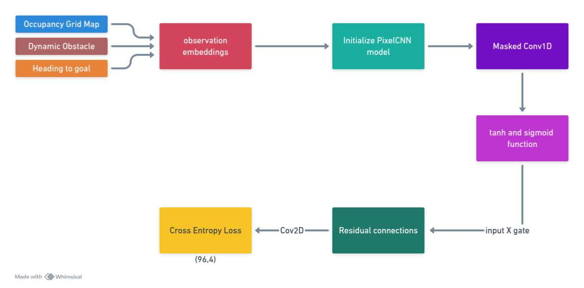

# Implementing generative AI for path planning for a mobile robot

- reimplementing with RVIZ visualiztion in closed loop with a rosbag
- implementing generative AI for path planning using VQ-VAE and PixelCNN

